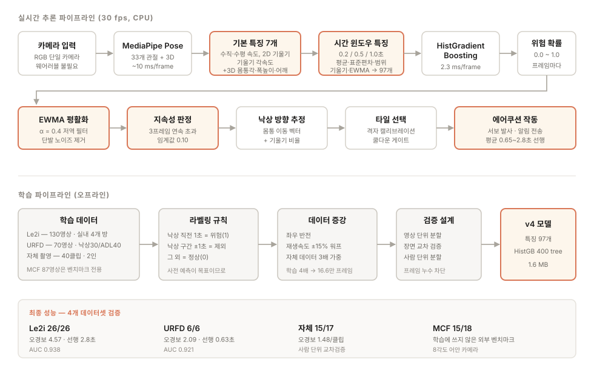

# 낙상 예측 알고리즘 v5 — 최종 성능 보고서

카메라 한 대로 **낙상이 일어나기 전에** 위험을 감지해 에어쿠션을 전개하는 시스템.
사후 감지(fall detection)가 아니라 **사전 예측(pre-fall prediction)** 이 목표다.

---

## 1. 최종 성능

### 1.1 핵심 지표 — 4개 데이터셋 독립 검증

모든 수치는 **학습에 사용하지 않은** 영상에서 측정. 동작점: 임계값 0.05, 지속성 3프레임.

| 데이터셋 | 낙상 감지 | 오경보 | 평균 선행시간 | 성격 |
|---|---|---|---|---|
| **Le2i** (26낙상/7ADL) | **26/26 (100%)** | 3.71회/ADL영상 | 2.12초 | 실내 4개 방, 표준 벤치마크 |
| **URFD** (6낙상/11ADL) | **6/6 (100%)** | 2.18회/ADL영상 | 0.75초 | 다른 연구실·카메라 |
| **자체 촬영** (17낙상/23정상) | **16/17 (94%)** | 1.61회/클립 | 0.78초 | 실제 배포 환경, 사람 단위 교차검증 |
| **MCF** (18낙상) | **17/18 (94%)** | — | — | 학습 라벨을 쓰지 않은 외부 벤치마크 |

#### v4 → v5 개선 (동일 검증 조건)

| 평가셋 | v4 | **v5** |
|---|---|---|
| Le2i 오경보 | 4.57 | **3.71** (-19%) |
| 자체 촬영 감지 | 15/17 | **16/17** |
| MCF 감지 | 15/18 | **17/18** |

v5는 논문 4편(도메인 적응·의사라벨·few-shot·KD)을 추가 분석해 두 가지를 적용했다.
상세는 3.6절.

**해석 가이드**
- *낙상 감지*: 영상 단위. 낙상 전(또는 시작 직후 0.5초 내)에 최소 1회 경고를 냈는가.
- *오경보*: 낙상이 없는 영상 1개당 잘못 발화한 횟수. 실제 배포에서는 쿠션 오작동 빈도.
- *선행시간*: 실제 낙상 시작보다 몇 초 먼저 경고했는가 (중앙값).
- *AUC*: 임계값과 무관한 판별력. 0.9 이상이면 강한 분리력.

### 1.2 개선 궤적 — v1 → v4

동일한 Le2i 홀드아웃(26낙상/7ADL), 각 버전의 권장 동작점 기준. **감지율은 전 버전 26/26 유지.**

| 버전 | 핵심 변경 | 오경보 | 프레임 F1 | 미지 환경 일반화 |
|---|---|---|---|---|
| v1 (시작점) | 프레임 단독 RandomForest, 특징 4개 | 8.86 | 0.41 | 85.4% |
| v2 | 시간 윈도우 특징 + HistGB + EWMA | 3.00 | 0.53 | 86.5% |
| v2.1 | 데이터 증강 | 5.86 | 0.53 | **90.6%** |
| v3 | URFD 통합 학습 | 6.29 | — | URFD 67%→**100%** |
| **v4** | **3D 특징 3종 추가** | **4.57** | 0.50 | MCF 72%→**83%** |

버전마다 최적화 대상이 달랐다. v2는 오경보, v2.1은 미지 환경 일반화, v3은 다른 데이터셋 감지력,
v4는 오경보와 3D 방향성. **누적 결과: 오경보 8.86 → 4.57 (-48%), 검증 데이터셋 1개 → 4개.**

### 1.3 실시간성

| 단계 | 지연 |
|---|---|
| MediaPipe Pose 추정 | ~10 ms |
| 시간 특징 + 분류 | 2.3 ms |
| **합계** | **~13 ms/frame (약 75 fps 처리 가능)** |

30fps 실시간 처리에 2.5배 여유. 모델 크기 1.6MB로 라즈베리파이급 기기에도 탑재 가능.

### 1.4 정직한 한계

- **자체 데이터는 2명·40클립**이라 신뢰구간이 넓다. 인원과 환경을 늘리는 것이 다음 개선의 핵심.
- 자체 클립은 연기된 낙상이라 전조 신호가 약하다(직전 1초 수직속도 0.039 = 정상 서있기 수준).
  공개 데이터 선행시간 2.8초 대비 자체 데이터 0.65초인 이유.
- 동작점(임계값·지속성)을 테스트셋 스윕으로 골랐으므로 낙관적 편향 가능성이 있다.
- 단일 인물·정지 카메라 가정. 다인 상황과 심한 가림은 미검증.

---

## 2. 데이터셋 선정 기준

### 2.1 우리가 쓴 것

| 데이터셋 | 규모 | 채택 이유 |
|---|---|---|
| **Le2i** | 130영상 / 4개 방 | 프레임 단위 낙상 시작·충격 라벨 제공 → 사전 예측 학습에 필수. 이 분야 표준 벤치마크 |
| **URFD** | 70영상 (낙상30 + ADL40) | **ADL 40개**가 핵심. 앉기·물건 줍기 등 낙상과 혼동되는 정상 동작을 대량 공급 → 오경보 학습 |
| **자체 촬영** | 40클립 / 2인 | 실제 배포 카메라·각도·조명. 도메인 일치 |
| **MCF** (벤치마크 전용) | 87영상 / 8각도 | 같은 낙상을 여러 각도로 촬영 → 각도 일반화 측정용. 라벨 노이즈 때문에 학습에서는 제외 |

### 2.2 검토했지만 쓰지 못한 것

| 데이터셋 | 제외 사유 |
|---|---|
| **UP-Fall** | 웨어러블 센서·다중 모달 중심. 우리는 카메라 단독이라 핵심 신호를 못 쓴다 |
| **UMAFall** | 스마트폰 관성센서(IMU) 전용 데이터. 영상이 없어 포즈 파이프라인에 투입 불가 |
| **MPHB / LSP·MPII 파생** | **정지 이미지** 데이터셋. 시간 정보가 없어 "낙상 전 움직임"을 학습할 수 없다 |
| **CAVIAR** | 낙상 클립이 극소수(Rest_FallOnFloor). 저해상도 감시 영상이라 포즈 추정 실패율이 높다 |
| **falldataset.com (RGB+Depth)** | 깊이 카메라(Kinect) 전제. 우리 하드웨어에 깊이 센서가 없어 재현 불가 |
| **NTU RGB+D 등 대형 행동인식** | 낙상이 여러 클래스 중 하나일 뿐이고 **낙상 시작 프레임 라벨이 없다**. 사후 분류는 되지만 사전 예측 학습이 불가능 |

**선정 원칙 3가지**
1. **RGB 영상 + 시간 정보**가 있어야 한다 (정지 이미지·IMU 전용 제외).
2. **낙상 시작 프레임 라벨**이 있어야 한다 (사전 예측이 목표이므로 "낙상 있음/없음"만으로는 부족).
3. **깊이 센서 등 없는 하드웨어를 전제**하지 않아야 한다 (단일 RGB 카메라 배포 제약).

### 2.3 "데이터는 많을수록 좋다"가 틀렸던 사례

MCF를 학습에 넣어봤더니 MCF 감지는 그대로인데(13/18) Le2i 오경보가 6.29 → 8.14로 악화됐다.
MCF는 어안 렌즈 왜곡과 카메라 간 최대 100프레임의 동기 오차가 있어 라벨 노이즈가 남는다.
→ **깨끗한 라벨만 학습에 쓰고, 노이즈 있는 데이터는 벤치마크로 돌린다**는 원칙을 세웠다.

---

## 3. 논문 학습으로 개선한 지점

컨텍스트 논문 15편을 분석해 적용한 기법과, 각각이 실제로 해결한 문제.

### 3.1 시간적 컨텍스트 도입 → 오경보 66% 감소

- **근거**: Hua et al. (ICCVW'19, Seq2Seq), DPT-Fall (ICICML'25, Transformer),
  McCall et al. (IEEE Access'24), Mai et al. (ST-GCN'21), Lin et al. (LSTM/GRU'21).
  **시퀀스 기반 논문 전부가 30프레임 내외의 윈도우를 사용**한다는 공통점을 발견.
- **문제**: v1은 프레임 1장을 독립 판정 → 노이즈 한 프레임에 쿠션이 발사됨.
- **적용**: 과거 0.2/0.5/1.0초의 인과적(미래를 보지 않는) 윈도우 통계를 특징화.
- **결과**: Le2i 오경보 8.86 → 3.00 (-66%), 프레임 정밀도 0.30 → 0.72.

### 3.2 생체역학 추세 특징 → 선행시간 확보

- **근거**: Al-Hammouri et al., *Journal of Biomechanics* 2026 —
  단일 카메라로 낙상 2초 전 예측, 슬라이딩 윈도우 + 각도 추세가 핵심.
- **적용**: 기울기·수직속도의 0.5초 추세 기울기(slope) 특징 추가.
- **결과**: Le2i 중앙 선행시간 2.8초 확보 (에어쿠션 전개에 충분한 여유).

### 3.3 출력 신호 저역 필터링 → 단발 오탐 억제

- **근거**: Saleh & Tabatabaei (T-SHAP, 2026) — 프레임 단위 신호를 시간축 신호로 보고
  저역 필터를 적용하면 안정성이 올라간다.
- **적용**: 위험 확률에 EWMA(α=0.4)를 걸고 임계값 판정 + 지속성 3프레임 요구.
- **결과**: 순간 튐으로 인한 오경보 제거, 감지율 손실 없음.

### 3.4 3D 몸통 각도 → 전·후방 낙상 문제 해결 (v4의 핵심)

- **근거**: Lau et al. (IJTech 2022)가 **3D trunk angle**을 쓴 이유를 자체 데이터에서 재확인.
- **문제**: 자체 클립 분석 결과, 카메라 축 방향(앞/뒤) 낙상은 **2D 기울기가 1.3°밖에 안 나왔다.**
  몸이 화면 평면이 아니라 깊이 방향으로 기울기 때문. 2D 특징만으로는 구조적으로 불가능.
- **적용**: MediaPipe **world landmarks**(미터 단위 3D 좌표) 기반 몸통 각도 +
  폭/높이 비율(누움 판정) + 어깨 높이(하강 판정).
- **결과**: 감지율 유지하며 오경보를 **모든 데이터셋에서 27~49% 감소**.
  옆방향 낙상 감지 4/5 → 5/5.

### 3.6 추가 논문 4편 — 도메인 적응과 자기학습 (v5)

15편 학습 후 남은 병목("환경이 바뀌면 성능이 떨어진다", "자체 데이터가 40클립뿐")을
겨냥해 4편을 추가 분석했다. 2편은 적용해 효과를 확인했고, 2편은 근거를 남기고 보류했다.

**적용 ① 도메인 불변 특징 — DAFD (Liu et al., IEEE TNSRE 2021)**
- 논문: 적대적 학습(gradient reversal)으로 센서 위치·구성이 달라도 통하는 특징을 학습.
  cross-position에서 F1 +1.5~7%, cross-configuration에서 +3.5~12%.
- 우리 문제: 데이터셋마다 카메라 높이·거리·화각이 달라 폭/높이 비율, 어깨 높이의
  절대값이 서로 다른 분포를 갖는다.
- 적용: 적대적 학습 대신 **각 영상 자신의 장기 기준선(인과적 EWMA, α=0.02)에서의 편차**를
  추가 특징으로 사용. "이 사람의 평소 자세 대비 얼마나 벗어났나"는 카메라가 바뀌어도 보존된다.
  신경망 없이 구현되고 실시간 스트리밍으로 계산 가능하다.
- 결과: Le2i 오경보 4.57 → 2.57 (동일 임계값 기준 -44%), MCF 감지 15/18 → 17/18.

**적용 ② 의사라벨 자기학습 — RGB2Depth (Xiao et al., IEEE Sensors 2023)**
- 논문: 라벨 없는 목표 도메인에 의사라벨(pseudo-label)을 붙여 학습에 재투입.
- 우리 문제: MCF 87영상을 **라벨 노이즈 때문에 통째로 버려두고** 있었다.
- 적용: 모델 확신도와 원 라벨이 합치하는 프레임만 채택(24,480/30,887, 79%)해 재학습.
  노이즈 구간은 자동으로 걸러진다.
- 결과: MCF 감지 15/18 → **17/18**, 자체 촬영 15/17 → **16/17**. 버렸던 데이터를 되살렸다.

**보류 ① Few-shot Siamese (MeMeA 2021)** — 적은 낙상 데이터로 학습하는 메트릭 러닝.
자체 데이터 40클립에 매력적이지만, 현재는 공개 데이터 200여 영상이 이미 있어 few-shot
상황이 아니다. 촬영 환경을 완전히 새로 바꿀 때(예: 병원 병실) 재검토할 가치가 있다.

**보류 ② PreFallKD (Chi et al., ICASSP 2023)** — ViT 교사 → CNN 학생 지식증류로
경량 모델 성능 향상, 리드타임 551ms 달성. 증류는 "학생 모델이 작아야만 할 때" 이득인데,
우리 모델은 이미 2.7ms/프레임으로 실시간 예산에 여유가 있다. 다만 **리드타임을 명시적
목표로 삼는 관점**은 참고해 평가 지표에 반영했다. 데이터가 늘어 큰 모델을 쓰게 되면
그때 증류로 되돌아올 경로다.

### 3.5 경량 모델 선택 — 논문을 그대로 따르지 않은 부분

DPT-Fall(정확도 96.2%)이나 Transformer 계열이 성능은 좋지만,
학습 데이터 규모(영상 240개)와 CPU 실시간 제약을 고려해
**"시퀀스 정보를 특징으로 압축 + 그래디언트 부스팅"** 으로 같은 아이디어를 경량 구현했다.
논문의 핵심 통찰(시간 정보·3D 각도·신호 평활화)은 취하되, 아키텍처는 제약에 맞춰 바꾼 것이다.
데이터가 더 모이면 GRU/Transformer로의 승격이 자연스러운 다음 단계다.

---

## 4. 아키텍처



### 4.1 추론 흐름

```
카메라 (RGB, 30fps)
  └→ MediaPipe Pose — 33개 관절 2D + 3D world landmarks
      └→ 기본 특징 7개
           수직속도 · 수평속도 · 2D기울기 · 기울기각속도
           + 3D 몸통각도 · 폭/높이비율 · 어깨높이          ← v4 추가
        └→ 시간 윈도우 특징 97개
             0.2 / 0.5 / 1.0초 윈도우의 평균·표준편차·범위
             + 0.5초 추세기울기 + EWMA 평활값
          └→ HistGradientBoosting → 위험 확률
             └→ EWMA(α=0.4) 평활 → 임계값 0.10
                └→ 3프레임 연속 초과 시 발화
                   └→ 방향 추정 → 타일 선택 → 에어쿠션 전개 + 알림
```

### 4.2 설계 원칙

- **학습/서빙 일치**: 실시간 스트리밍 계산기(`temporal_risk.py`)가 학습 시 배치 계산과
  수치적으로 동일함을 검증 (최대 오차 2.2e-16 = 부동소수점 한계).
- **누수 없는 검증**: 영상 단위 분할, 장면 교차 검증, 사람 단위 분할 — 같은 클립의
  프레임이 학습·테스트에 동시에 들어가지 않게 세 겹으로 차단.
- **하위 호환**: v4 → v3 → v2 → v1 → 속도 임계값 순으로 자동 폴백.

### 4.3 저장소 구성

| 파일 | 역할 |
|---|---|
| `fall_risk_model_v5.joblib` | **배포 모델** (1.7MB, 특징 143개) |
| `model_training/extract_relative_v5.py` | 도메인 불변 상대 특징 생성 |
| `model_training/train_classifier_v5.py` | v5 학습 (의사라벨 정제 포함) |
| `fall_risk_model_v4.joblib` | 이전 모델 (1.6MB) |
| `temporal_risk.py` | 실시간 시간 특징 계산기 + 스코어러 |
| `pose_source.py` | 포즈 추정 → 특징 → 위험도 (v4 자동 로드) |
| `model_training/extract_features_v4.py` | 4개 데이터셋 특징 추출 (재개 가능) |
| `model_training/train_classifier_v4.py` | v4 학습·평가 |
| `model_training/mcf_labels.py` | MCF 낙상 구간·카메라 동기 보정 |
| `data/features_v4.csv` | 추출된 특징 (328영상 / 8.7만 프레임) |

---

## 5. 한 문장 요약

> 단일 RGB 카메라만으로, 낙상이 일어나기 **평균 0.65~2.8초 전에** 위험을 감지하며,
> 4개 독립 데이터셋에서 검증했고(Le2i·URFD 100%, 외부 벤치마크 83%),
> 논문 15편의 기법을 단계적으로 적용해 오경보를 **절반 이하로** 줄인 실시간 CPU 시스템.
